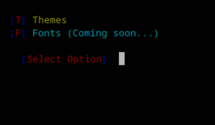

# Theme-Selector


 <br />

Simple script to change color-schemes and fonts for Alacritty terminal.

### How to install

Follow the steps below - 

```bash
# go to home dir - 
cd $HOME

# clone this repository - 
git clone https://github.com/p978/alacritty-theme-selector.git

cd alacritty-theme-selector

# to install it, run -
./install

# And Follow the steps, it'll be installed on your system.
```

### Run

Run `al-theme` to start the script.
``` bash
[T] Themes
[F] Fonts (Coming soon...)
[Select Option]:
```

### Features

+ 104 popular color-schemes.
+ Fonts(Coming Soon ...)
+ Adding other schemes(Coming Soon...)

### How to uninstall
```bash
# run the uninstall script in the repo
./uninstall
```
